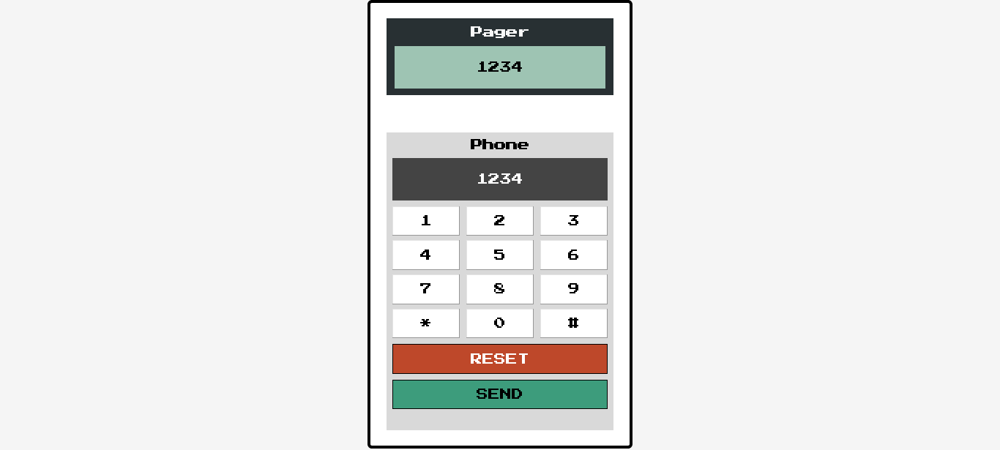

# Scrimba Bootcamp - Solo Projects

This is a solution to the [M3 - Send to Pager](https://scrimba.com/scrim/co9b447f7b7a0dc6201d27636).

## Screenshot

## Links

- Live Site: [Netlify](https://transcendent-moonbeam-72a749.netlify.app/)
- Codebase: [Github](https://github.com/abilioassis/send-to-pager)
- Code review: [Scrimba]()

## Built with

- Semantic HTML5 markup.
- Flexbox.
- JavaScript (no frameworks).

## Author

- [Abilio Assis](https://www.linkedin.com/in/abilio-assis/)
